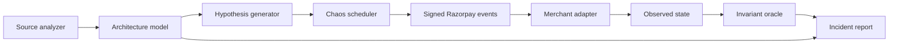

# PayChaos

> **AI can build a payment integration in minutes. PayChaos proves whether it can survive production.**

PayChaos is an AI-powered payment reliability engineer. It understands how an
application handles payments, forms application-specific failure hypotheses,
executes them with a deterministic chaos engine, and validates the observed
system state against financial invariants.

It does not ask only, “Does this payment flow work?”

It asks, **“What happens after the database commits, the acknowledgement is
lost, and the same webhook arrives again?”**

## What works today

The current buildathon vertical slice demonstrates four complete reliability
loops against a Razorpay-shaped integration:

1. Map an Express and Prisma webhook handler.
2. Detect a financial side effect without an event-level idempotency boundary.
3. Generate a post-commit-timeout hypothesis from the detected architecture.
4. Sign a Razorpay-shaped raw webhook payload with HMAC-SHA256.
5. Deliver it, commit the fulfilment, and lose the HTTP acknowledgement.
6. Retry the identical `x-razorpay-event-id`.
7. Validate the resulting database state deterministically.
8. Apply an atomic event-claim control and replay the exact campaign.

The vulnerable implementation fails with two fulfilments for one payment. The
protected implementation absorbs the duplicate and passes.

`CHAOS-001` now executes this replay against a running Express merchant over
real loopback HTTP. PayChaos aborts the first client acknowledgement after the
target commits, retries the identical signed request, and evaluates the
invariant from the target's instrumented state endpoint. API responses label
whether evidence came from `live-http` or a `deterministic-model`.

The second campaign delivers `payment.captured` before releasing an older,
delayed `payment.failed` event. A last-write-wins handler regresses the payment
to `FAILED`; a monotonic state guard preserves `CAPTURED`.

The third campaign kills the merchant after its database transaction commits
but before shipment dispatch. Event deduplication prevents duplicate local work
on retry, yet also makes the missing shipment permanent. The protected version
atomically records a uniquely keyed outbox intent, which a restarted worker
recovers without creating a second fulfilment.

The fourth campaign targets a subtler bug: an idempotency check that exists but
is not atomic. Two workers both read “event not processed” before either writes,
then create duplicate fulfilments four virtual milliseconds apart. A unique
event claim inside the fulfilment transaction serializes the protected replay.

An optional Razorpay Test Mode connector now verifies the real provider API
boundary. After an explicit click, it creates one fixed ₹5 test order, fetches
it by ID, and compares the normalized evidence. Live keys are rejected before
network I/O and the fully local experience remains available without
credentials. See [docs/RAZORPAY_TEST_MODE.md](docs/RAZORPAY_TEST_MODE.md).

Every proven failure can also be exported as a standalone Vitest regression.
The artifact preserves the signed raw payload, event ID, schedule and financial
invariant, then requires both reproduction on the vulnerable adapter and a pass
on the protected adapter. The included `CHAOS-001` regression runs against the
live HTTP target in the regular test suite. See
[docs/REGRESSIONS.md](docs/REGRESSIONS.md).

The bounded Node runner can copy and attack a selected JavaScript payment
target through a tiny synchronous contract. It places the target in a separate,
permission-restricted 64 MB child with no child network, applies CPU and wall
timeouts, exposes only a parent-owned loopback gateway, captures deterministic
state evidence, and destroys the workspace after every run. See
[docs/SANDBOX.md](docs/SANDBOX.md) for its precise security scope.

| Campaign | Fault sequence | Financial invariant |
| --- | --- | --- |
| `CHAOS-001` | Deliver → Commit → Timeout → Retry | One payment creates at most one fulfilment |
| `CHAOS-002` | Capture → Delay → Stale failure → Inspect | A captured payment cannot regress to failed |
| `CHAOS-003` | Commit → Crash → Restart → Recover | One captured order creates exactly one shipment job |
| `CHAOS-004` | Fork → Read → Race → Inspect | Simultaneous delivery creates at most one fulfilment |

## The important boundary

```text
AI / source analysis                 Deterministic engine
────────────────────                 ────────────────────
Understand architecture        →     Sign and deliver events
Discover invariants            →     Inject exact fault sequence
Generate hypotheses            →     Observe database state
Explain a proven failure       ←     Pass or fail invariant
```

The intelligence layer is allowed to be uncertain. It can suggest the wrong
hypothesis. It cannot declare that money was lost. A campaign fails only when a
deterministic invariant is violated by observed state.

## Quick start

Requires Node.js 20.19 or newer.

```bash
npm install
npm run dev
```

Open [http://localhost:5173](http://localhost:5173).

Useful commands:

```bash
npm test          # deterministic engine and signature tests
npm run build     # typecheck and production client build
npm run scan -- . # inspect a local repository without executing it
npm run dev:api   # API only, on port 8787
npm run dev:web   # dashboard only, on port 5173
```

Run the scanner against the bundled comparison fixtures:

```bash
npm run scan -- ./fixtures/vulnerable-merchant
npm run scan -- ./fixtures/protected-merchant
npm run scan -- ./fixtures/crash-vulnerable
npm run scan -- ./fixtures/crash-protected
npm run scan -- ./fixtures/concurrency-vulnerable
npm run scan -- ./fixtures/concurrency-protected
npm run scan -- /path/to/your/project --json
```

The scanner walks bounded source files, skips dependencies, build output and
symlinks, and never executes target code. It detects Razorpay webhook surfaces,
signature boundaries, atomic event claims, database transactions, state guards,
transactional outboxes and financial side effects. See
[docs/SCANNING.md](docs/SCANNING.md).

The same scanner is available in the dashboard. Use either bundled fixture or
choose a local repository directory; supported source files are read by the
browser and sent only to the local PayChaos process.

### Optional AI enrichment

PayChaos works without a model key using `grounded-rules-v1`. To enable explicit
AI enrichment, copy the example environment file and add a key:

```bash
cp .env.example .env
# set OPENAI_API_KEY, then restart npm run dev
```

The AI request uses the OpenAI Responses API with strict JSON Schema output and
`store: false`. It receives bounded scan metadata—not source content or the
absolute repository path—and runs only after **Send scan metadata to OpenAI** is
clicked. See [docs/INTELLIGENCE.md](docs/INTELLIGENCE.md).

### Optional Razorpay Test Mode verification

Add `RAZORPAY_KEY_ID` and `RAZORPAY_KEY_SECRET` from Razorpay Test Mode to your
local `.env`, restart the API, then use the connector panel. PayChaos accepts
only `rzp_test_` keys and creates an order without authorizing or capturing a
payment. Credentials never enter the client bundle.

## Demo flow

The dashboard starts on the **Vulnerable baseline** and runs `CHAOS-001`:

```text
Deliver → Commit → Timeout acknowledgement → Retry identical event
```

The campaign evaluates:

```text
INV-001: count(fulfilments where payment_id = P) <= 1
```

Select **Verify fix** to replay the same signed event and failure schedule
against the protected implementation. The unique event claim and fulfilment
write occur within the same transaction, so the retry becomes a no-op.

For the complete five-minute walkthrough, see [docs/DEMO.md](docs/DEMO.md).

## Architecture



See [docs/ARCHITECTURE.md](docs/ARCHITECTURE.md) for component boundaries,
execution rules, and the path from this local slice to a sandboxed repository
runner.

## API

| Method | Route | Purpose |
| --- | --- | --- |
| `GET` | `/api/health` | Runtime health |
| `GET` | `/api/overview` | Demo target and scenario metadata |
| `GET` | `/api/intelligence/status` | Local or optional model-provider status |
| `GET` | `/api/razorpay/status` | Safe Test Mode connector status; no provider call |
| `GET` | `/api/sandbox/status` | Target contract and enforced execution bounds |
| `GET` | `/api/source/:scenario/:mode` | Scenario-specific vulnerable or protected source evidence |
| `POST` | `/api/campaigns` | Run the deterministic campaign |
| `POST` | `/api/repositories/demo/:mode` | Scan a bundled fixture repository |
| `POST` | `/api/repositories/analyze` | Analyze bounded browser-selected files |
| `POST` | `/api/intelligence/hypothesize` | Explicitly enrich a retained scan |
| `POST` | `/api/razorpay/test-order` | Explicitly create, fetch and verify one ₹5 test order |
| `POST` | `/api/regressions/:scenario` | Generate a checksummed standalone Vitest regression |
| `POST` | `/api/sandbox/demo/:mode` | Execute a bounded vulnerable or protected target |
| `POST` | `/api/sandbox/run` | Execute browser-selected JavaScript under the narrow contract |

Campaign request:

```json
{
  "scenario": "duplicate-after-timeout",
  "mode": "vulnerable"
}
```

Use `"out-of-order-regression"` for the state-ordering campaign,
`"crash-before-side-effect"` for crash recovery,
`"concurrent-delivery-race"` for the read-write race, and `"protected"` to
verify the relevant control against the identical event schedule.

## Repository map

```text
src/
├── client/       React campaign console
├── connectors/   Razorpay Test Mode provider boundary
├── sandbox/      Permission-restricted Node target runner
├── core/         Analysis, Razorpay signing, merchant model, chaos engine
├── cli/          Bounded local repository scanner
└── server/       Local campaign API and production asset server
docs/
├── ARCHITECTURE.md
├── DEMO.md
├── DELIVERY_PLAN.md
├── INTELLIGENCE.md
├── RAZORPAY_TEST_MODE.md
├── REGRESSIONS.md
├── SANDBOX.md
└── SCANNING.md
```

## Delivery roadmap

Phases 1 through 4—live HTTP execution, the safe Razorpay connector, executable
regressions, and bounded Node target execution—are complete. The remaining work
is submission hardening, evaluation, and deployment readiness.
sequenced in [docs/DELIVERY_PLAN.md](docs/DELIVERY_PLAN.md).

1. Evaluate, deploy and harden the final submission.

## Safety

PayChaos is a defensive test system. The scanner reads bounded local source
files without executing them. The engine attacks its local demo target, while
the optional provider connector is limited to fixed Test Mode order creation
and verification. Production credentials, live payment actions, and arbitrary
external endpoints are rejected or outside the supported boundary.

---

**We do not test whether your payment integration works. We test whether it survives.**
