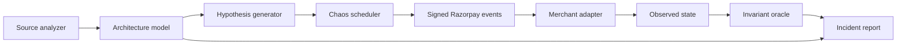

# PayChaos

> **AI can build a payment integration in minutes. PayChaos proves whether it can survive production.**

PayChaos is an AI-powered payment reliability engineer. It understands how an
application handles payments, forms application-specific failure hypotheses,
executes them with a deterministic chaos engine, and validates the observed
system state against financial invariants.

It does not ask only, “Does this payment flow work?”

It asks, **“What happens after the database commits, the acknowledgement is
lost, and the same webhook arrives again?”**

## What works today

The current buildathon vertical slice demonstrates one complete reliability
loop against a Razorpay-shaped integration:

1. Map an Express and Prisma webhook handler.
2. Detect a financial side effect without an event-level idempotency boundary.
3. Generate a post-commit-timeout hypothesis from the detected architecture.
4. Sign a Razorpay-shaped raw webhook payload with HMAC-SHA256.
5. Deliver it, commit the fulfilment, and lose the HTTP acknowledgement.
6. Retry the identical `x-razorpay-event-id`.
7. Validate the resulting database state deterministically.
8. Apply an atomic event-claim control and replay the exact campaign.

The vulnerable implementation fails with two fulfilments for one payment. The
protected implementation absorbs the duplicate and passes.

## The important boundary

```text
AI / source analysis                 Deterministic engine
────────────────────                 ────────────────────
Understand architecture        →     Sign and deliver events
Discover invariants            →     Inject exact fault sequence
Generate hypotheses            →     Observe database state
Explain a proven failure       ←     Pass or fail invariant
```

The intelligence layer is allowed to be uncertain. It can suggest the wrong
hypothesis. It cannot declare that money was lost. A campaign fails only when a
deterministic invariant is violated by observed state.

## Quick start

Requires Node.js 20.19 or newer.

```bash
npm install
npm run dev
```

Open [http://localhost:5173](http://localhost:5173).

Useful commands:

```bash
npm test          # deterministic engine and signature tests
npm run build     # typecheck and production client build
npm run dev:api   # API only, on port 8787
npm run dev:web   # dashboard only, on port 5173
```

## Demo flow

The dashboard starts on the **Vulnerable baseline** and runs `CHAOS-001`:

```text
Deliver → Commit → Timeout acknowledgement → Retry identical event
```

The campaign evaluates:

```text
INV-001: count(fulfilments where payment_id = P) <= 1
```

Select **Verify fix** to replay the same signed event and failure schedule
against the protected implementation. The unique event claim and fulfilment
write occur within the same transaction, so the retry becomes a no-op.

For the complete five-minute walkthrough, see [docs/DEMO.md](docs/DEMO.md).

## Architecture



See [docs/ARCHITECTURE.md](docs/ARCHITECTURE.md) for component boundaries,
execution rules, and the path from this local slice to a sandboxed repository
runner.

## API

| Method | Route | Purpose |
| --- | --- | --- |
| `GET` | `/api/health` | Runtime health |
| `GET` | `/api/overview` | Demo target and scenario metadata |
| `GET` | `/api/source/:mode` | Vulnerable or protected source evidence |
| `POST` | `/api/campaigns` | Run the deterministic campaign |

Campaign request:

```json
{ "mode": "vulnerable" }
```

Use `"protected"` to verify the control against the identical event and fault
schedule.

## Repository map

```text
src/
├── client/       React campaign console
├── core/         Analysis, Razorpay signing, merchant model, chaos engine
└── server/       Local campaign API and production asset server
docs/
├── ARCHITECTURE.md
└── DEMO.md
```

## Buildathon roadmap

- Scan a user-selected Git repository instead of the bundled merchant fixture.
- Add a schema-constrained model provider for architecture mapping and
  hypothesis generation, retaining the local analyzer as a no-key fallback.
- Add out-of-order state transitions and crash-after-commit campaigns.
- Run merchant applications in disposable, network-isolated sandboxes.
- Capture database queries, logs, spans, and fulfilment side effects as evidence.
- Generate a regression test and open a reviewable patch after user approval.
- Evaluate hypothesis precision and deterministic reproduction rate across a
  corpus of vulnerable and hardened integrations.

## Safety

PayChaos is a defensive test system. The current engine runs only against its
local demo target. Production credentials, live payment actions, and arbitrary
external endpoints are intentionally outside this slice.

---

**We do not test whether your payment integration works. We test whether it survives.**
