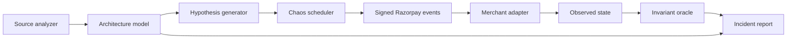

# PayChaos

> **AI can build a payment integration in minutes. PayChaos proves whether it can survive production.**

PayChaos is an AI-powered payment reliability engineer. It understands how an
application handles payments, forms application-specific failure hypotheses,
executes them with a deterministic chaos engine, and validates the observed
system state against financial invariants.

It does not ask only, “Does this payment flow work?”

It asks, **“What happens after the database commits, the acknowledgement is
lost, and the same webhook arrives again?”**

## What works today

The current buildathon vertical slice demonstrates two complete reliability
loops against a Razorpay-shaped integration:

1. Map an Express and Prisma webhook handler.
2. Detect a financial side effect without an event-level idempotency boundary.
3. Generate a post-commit-timeout hypothesis from the detected architecture.
4. Sign a Razorpay-shaped raw webhook payload with HMAC-SHA256.
5. Deliver it, commit the fulfilment, and lose the HTTP acknowledgement.
6. Retry the identical `x-razorpay-event-id`.
7. Validate the resulting database state deterministically.
8. Apply an atomic event-claim control and replay the exact campaign.

The vulnerable implementation fails with two fulfilments for one payment. The
protected implementation absorbs the duplicate and passes.

The second campaign delivers `payment.captured` before releasing an older,
delayed `payment.failed` event. A last-write-wins handler regresses the payment
to `FAILED`; a monotonic state guard preserves `CAPTURED`.

| Campaign | Fault sequence | Financial invariant |
| --- | --- | --- |
| `CHAOS-001` | Deliver → Commit → Timeout → Retry | One payment creates at most one fulfilment |
| `CHAOS-002` | Capture → Delay → Stale failure → Inspect | A captured payment cannot regress to failed |

## The important boundary

```text
AI / source analysis                 Deterministic engine
────────────────────                 ────────────────────
Understand architecture        →     Sign and deliver events
Discover invariants            →     Inject exact fault sequence
Generate hypotheses            →     Observe database state
Explain a proven failure       ←     Pass or fail invariant
```

The intelligence layer is allowed to be uncertain. It can suggest the wrong
hypothesis. It cannot declare that money was lost. A campaign fails only when a
deterministic invariant is violated by observed state.

## Quick start

Requires Node.js 20.19 or newer.

```bash
npm install
npm run dev
```

Open [http://localhost:5173](http://localhost:5173).

Useful commands:

```bash
npm test          # deterministic engine and signature tests
npm run build     # typecheck and production client build
npm run scan -- . # inspect a local repository without executing it
npm run dev:api   # API only, on port 8787
npm run dev:web   # dashboard only, on port 5173
```

Run the scanner against the bundled comparison fixtures:

```bash
npm run scan -- ./fixtures/vulnerable-merchant
npm run scan -- ./fixtures/protected-merchant
npm run scan -- /path/to/your/project --json
```

The scanner walks bounded source files, skips dependencies, build output and
symlinks, and never executes target code. It detects Razorpay webhook surfaces,
signature boundaries, event-ID claims, database transactions, state guards and
financial side effects. See [docs/SCANNING.md](docs/SCANNING.md).

The same scanner is available in the dashboard. Use either bundled fixture or
choose a local repository directory; supported source files are read by the
browser and sent only to the local PayChaos process.

### Optional AI enrichment

PayChaos works without a model key using `grounded-rules-v1`. To enable explicit
AI enrichment, copy the example environment file and add a key:

```bash
cp .env.example .env
# set OPENAI_API_KEY, then restart npm run dev
```

The AI request uses the OpenAI Responses API with strict JSON Schema output and
`store: false`. It receives bounded scan metadata—not source content or the
absolute repository path—and runs only after **Send scan metadata to OpenAI** is
clicked. See [docs/INTELLIGENCE.md](docs/INTELLIGENCE.md).

## Demo flow

The dashboard starts on the **Vulnerable baseline** and runs `CHAOS-001`:

```text
Deliver → Commit → Timeout acknowledgement → Retry identical event
```

The campaign evaluates:

```text
INV-001: count(fulfilments where payment_id = P) <= 1
```

Select **Verify fix** to replay the same signed event and failure schedule
against the protected implementation. The unique event claim and fulfilment
write occur within the same transaction, so the retry becomes a no-op.

For the complete five-minute walkthrough, see [docs/DEMO.md](docs/DEMO.md).

## Architecture



See [docs/ARCHITECTURE.md](docs/ARCHITECTURE.md) for component boundaries,
execution rules, and the path from this local slice to a sandboxed repository
runner.

## API

| Method | Route | Purpose |
| --- | --- | --- |
| `GET` | `/api/health` | Runtime health |
| `GET` | `/api/overview` | Demo target and scenario metadata |
| `GET` | `/api/intelligence/status` | Local or optional model-provider status |
| `GET` | `/api/source/:scenario/:mode` | Scenario-specific vulnerable or protected source evidence |
| `POST` | `/api/campaigns` | Run the deterministic campaign |
| `POST` | `/api/repositories/demo/:mode` | Scan a bundled fixture repository |
| `POST` | `/api/repositories/analyze` | Analyze bounded browser-selected files |
| `POST` | `/api/intelligence/hypothesize` | Explicitly enrich a retained scan |

Campaign request:

```json
{
  "scenario": "duplicate-after-timeout",
  "mode": "vulnerable"
}
```

Use `"out-of-order-regression"` for the state-ordering campaign and
`"protected"` to verify its control against the identical event schedule.

## Repository map

```text
src/
├── client/       React campaign console
├── core/         Analysis, Razorpay signing, merchant model, chaos engine
├── cli/          Bounded local repository scanner
└── server/       Local campaign API and production asset server
docs/
├── ARCHITECTURE.md
├── DEMO.md
├── INTELLIGENCE.md
└── SCANNING.md
```

## Buildathon roadmap

- Add authenticated GitHub ingestion on top of the working local scanner.
- Evaluate the schema-constrained model provider across the vulnerability corpus.
- Add crash-after-commit and concurrent-capture campaigns.
- Run merchant applications in disposable, network-isolated sandboxes.
- Capture database queries, logs, spans, and fulfilment side effects as evidence.
- Generate a regression test and open a reviewable patch after user approval.
- Evaluate hypothesis precision and deterministic reproduction rate across a
  corpus of vulnerable and hardened integrations.

## Safety

PayChaos is a defensive test system. The scanner reads bounded local source
files without executing them, and the current engine runs only against its
local demo target. Production credentials, live payment actions, and arbitrary
external endpoints are intentionally outside this slice.

---

**We do not test whether your payment integration works. We test whether it survives.**
