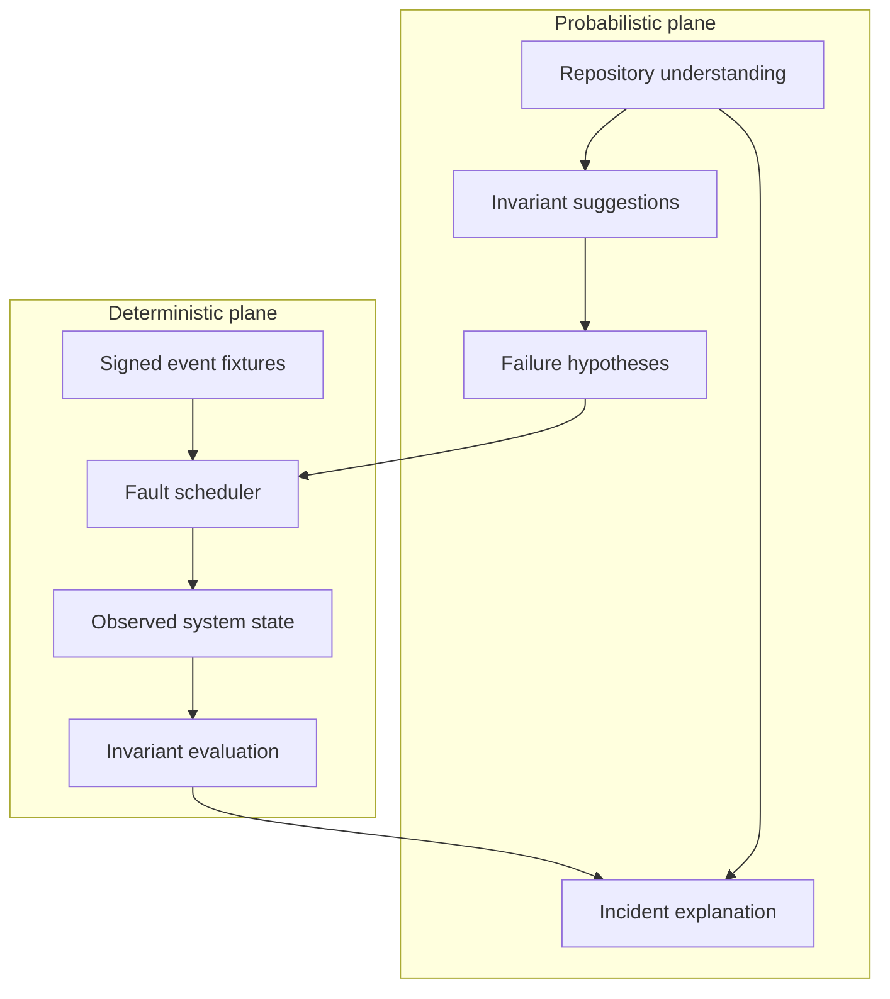

# Architecture

PayChaos separates probabilistic reasoning from financial truth. This is the
central design constraint, not an implementation detail.

## Components

### 1. Architecture analyzer

The analyzer converts payment code into a compact architecture model:

- webhook entrypoint and subscribed event;
- signature-verification boundary;
- database writes and irreversible business side effects;
- transaction boundaries;
- idempotency keys and uniqueness constraints;
- payment-state transitions.

The local MVP performs this analysis against two bundled Express and Prisma
handlers. A model-backed provider can later produce the same typed structure
for unfamiliar repositories without changing the campaign engine.

### 2. Hypothesis generator

Hypotheses are grounded in detected evidence. For example:

```text
Evidence:
  payment.captured → fulfilment.create → HTTP 200
  no x-razorpay-event-id claim detected

Hypothesis:
  if the database commits but the acknowledgement is lost,
  retrying the event can repeat fulfilment.
```

A hypothesis contains a fault plan and the invariant that will determine its
outcome. It is not itself a finding.

### 3. Deterministic chaos scheduler

The scheduler owns event payloads, delivery order, duplicated IDs, virtual
timestamps, injected failures, and replay. The same campaign definition must
produce the same observable sequence.

`CHAOS-001` currently runs:

```text
t+0.76  verify HMAC signature
t+0.82  deliver payment.captured
t+1.00  commit fulfilment
t+1.21  lose acknowledgement after commit
t+1.72  schedule at-least-once retry
t+2.42  verify the same HMAC signature
t+2.48  redeliver the same event ID
t+3.24  evaluate financial invariant
```

### 4. Merchant adapter

The adapter is the narrow interface between a campaign and the system under
test. In the local MVP it is an in-memory merchant with vulnerable and
protected modes. A sandbox adapter will later translate the same operations to
HTTP, process, database, and telemetry controls around a real application.

### 5. Invariant oracle

The oracle evaluates observed state, never generated prose.

Current invariant:

```text
INV-001 exactly-once fulfilment
count(fulfilments where payment_id = P) <= 1
```

Future invariants will cover state monotonicity, amount conservation, capture
and refund bounds, order-to-payment cardinality, and once-only external side
effects.

### 6. Incident reconstruction

The report joins the architecture evidence, hypothesis, execution timeline,
database outcome, failed invariant, financial exposure, reproduction steps,
and recommended control. Explanations are downstream of proof.

## Trust boundaries



The probabilistic plane may prioritize or explain. The deterministic plane
alone decides pass or fail.

## Moving from the MVP to repository execution

The intended runner lifecycle is:

1. Clone a user-authorized repository at an immutable commit.
2. Detect its runtime, payment surface, and test command without executing code.
3. Present the inferred execution plan and required capabilities.
4. Build inside a disposable sandbox with no production credentials.
5. Start the application and disposable backing services.
6. Execute signed test-mode campaigns through a narrow network proxy.
7. collect structured logs, traces, database diffs, and outbound side effects.
8. Destroy the sandbox and retain only redacted evidence.

Repository code and logs are untrusted input. Generated commands must never be
executed directly outside the sandbox boundary.
