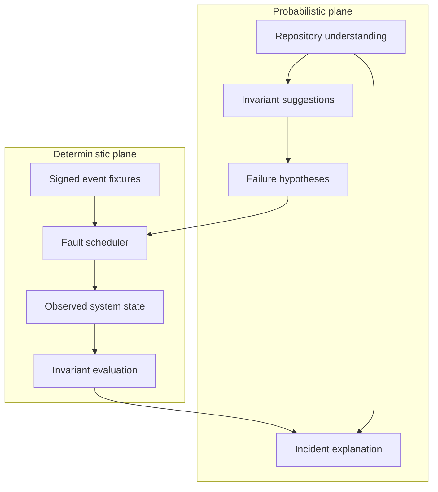

# Architecture

PayChaos separates probabilistic reasoning from financial truth. This is the
central design constraint, not an implementation detail.

## Components

### 1. Architecture analyzer

The analyzer converts payment code into a compact architecture model:

- webhook entrypoint and subscribed event;
- signature-verification boundary;
- database writes and irreversible business side effects;
- transaction boundaries;
- idempotency keys and uniqueness constraints;
- read-write gaps inside apparent idempotency controls;
- payment-state transitions;
- durable outbox handoffs around external side effects.

The local MVP includes a bounded repository scanner that maps TypeScript,
JavaScript, Python, Java, Go, Ruby, PHP and C# source files without executing
them. It detects Razorpay webhook surfaces and control boundaries before
producing hypothesis candidates. An optional schema-constrained model provider
can enrich the same typed structure without changing the campaign engine, while
the deterministic local provider keeps development and evaluation key-free.

### 2. Hypothesis generator

Hypotheses are grounded in detected evidence. For example:

```text
Evidence:
  payment.captured → fulfilment.create → HTTP 200
  no x-razorpay-event-id claim detected

Hypothesis:
  if the database commits but the acknowledgement is lost,
  retrying the event can repeat fulfilment.
```

A hypothesis contains a fault plan and the invariant that will determine its
outcome. It is not itself a finding.

### 3. Deterministic chaos scheduler

The scheduler owns event payloads, delivery order, duplicated IDs, virtual
timestamps, injected failures, and replay. The same campaign definition must
produce the same observable sequence.

`CHAOS-001` currently runs:

```text
t+0.76  verify HMAC signature
t+0.82  deliver payment.captured
t+1.00  commit fulfilment
t+1.21  lose acknowledgement after commit
t+1.72  schedule at-least-once retry
t+2.42  verify the same HMAC signature
t+2.48  redeliver the same event ID
t+3.24  evaluate financial invariant
```

`CHAOS-002` currently runs:

```text
t+0.70  verify and deliver a newer payment.captured snapshot
t+0.92  persist CAPTURED
t+1.58  release a payment.failed event created 60 seconds earlier
t+1.72  verify the authentic but stale failure
t+1.94  apply or block the requested state regression
t+2.26  evaluate the monotonic-state invariant
```

`CHAOS-003` currently runs:

```text
t+0.68  verify and deliver payment.captured
t+0.90  commit the event claim and local fulfilment
t+1.05  terminate the process before shipment dispatch
t+1.64  restart the merchant and outbox worker
t+1.88  recover the durable intent, or prove that none exists
t+2.30  retry the identical event ID
t+2.78  evaluate the shipment-job invariant
```

`CHAOS-004` currently runs:

```text
t+0.52  fork one signed event to two workers
t+0.61  verify the identical payload in both workers
t+0.76  pause both after they read event history
t+0.82  release worker A to commit fulfilment
t+0.824 release worker B into the same write path
t+1.08  evaluate the concurrent-fulfilment invariant
```

### 4. Merchant adapter

The adapter is the narrow interface between a campaign and the system under
test. `CHAOS-001` now starts a running Express merchant on an ephemeral loopback
port, delivers both signed requests through HTTP, and reads observed state from
a narrow instrumentation endpoint. The target is always stopped after the
campaign. Its vulnerable and protected modes share the same transport and fault
schedule.

The other campaigns remain deterministic in-process merchant models. Every
campaign report identifies its execution kind, target, transport, request count
and state-read count so simulated and live evidence cannot be confused. The
bounded Node adapter now applies the live protocol to a deliberately narrow,
selected JavaScript target with explicit process, filesystem, network, memory,
output and time bounds.

### 5. Invariant oracle

The oracle evaluates observed state, never generated prose.

Current invariant:

```text
INV-001 exactly-once fulfilment
count(fulfilments where payment_id = P) <= 1

INV-002 captured state is monotonic
captured(P) implies final_status(P) = CAPTURED

INV-003 durable fulfilment dispatch
captured(P) implies count(shipment_jobs(order(P))) = 1

INV-004 atomic concurrent fulfilment
concurrent(deliveries(E)) implies count(fulfilments(payment(E))) <= 1
```

Future invariants will cover amount conservation, capture and refund bounds,
order-to-payment cardinality, and partial failure across multi-step refunds.

### 6. Incident reconstruction

The report joins the architecture evidence, hypothesis, execution timeline,
database outcome, failed invariant, financial exposure, reproduction steps,
and recommended control. Explanations are downstream of proof.

## Trust boundaries



The probabilistic plane may prioritize or explain. The deterministic plane
alone decides pass or fail.

## Razorpay provider boundary

The optional connector is a diagnostic input, not an oracle. It creates a fixed
₹5 Test Mode order only after explicit user action, fetches the same order by
ID, and verifies stable fields before normalizing it. It cannot capture a
payment and rejects every key outside the `rzp_test_` namespace before network
I/O. Credentials remain server-side and are excluded from logs, responses and
browser bundles.

## Intelligence provider boundary

Repository analysis is a two-step, consent-preserving flow:

1. Source files are scanned locally and assigned a short-lived scan ID.
2. Only an explicit enrichment request can send bounded scan metadata to the
   configured model provider.

Raw source, absolute repository roots and credentials are excluded from the
model input. The Responses API request uses strict JSON Schema output and
`store: false`. Provider failure falls back to grounded local rules instead of
blocking deterministic campaigns.

## Bounded repository execution

The current runner accepts a synchronous `globalThis.paychaosTarget` contract,
copies only selected JavaScript files, and executes the entry inside a
permission-restricted child plus capability-minimal VM context. The target has
no network capability; a trusted parent-owned gateway supplies HTTP transport.
Every run ends by killing the child and deleting the disposable workspace.

This is intentionally narrower than executing a repository's install or test
scripts. It demonstrates the adapter and evidence boundary without pretending a
language VM alone is hostile multi-tenant isolation. See [SANDBOX.md](SANDBOX.md).

## Production repository execution

The production runner lifecycle is:

1. Clone a user-authorized repository at an immutable commit.
2. Detect its runtime, payment surface, and test command without executing code.
3. Present the inferred execution plan and required capabilities.
4. Build inside a disposable sandbox with no production credentials.
5. Start the application and disposable backing services.
6. Execute signed test-mode campaigns through a narrow network proxy.
7. collect structured logs, traces, database diffs, and outbound side effects.
8. Destroy the sandbox and retain only redacted evidence.

Repository code and logs are untrusted input. Generated commands must never be
executed directly outside the sandbox boundary.

The current scanner is intentionally read-only. It skips symlinks, dependency
trees, generated output, oversized files, and repositories beyond explicit file
and byte limits. See [SCANNING.md](SCANNING.md).
